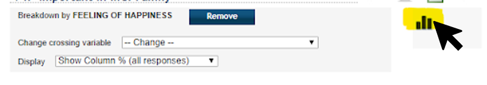

## 1. Discovery Process of the [World Values Survey's Online Analysis Tools](http://www.worldvaluessurvey.org/WVSOnline.jsp)

### Question: How does the feeling of happiness in European countries impact the perceived importance of life values like family and religion?

### Figure 1

### Figure 2

Countries could be ordered in a way that conveys information about their geographic location/relation. 

### Figure 3

I want to compare V4 through V9 with V10;  expected to be able to select multiple variables to show.

### Figure 4 

A majority of total respondents ranked family as “Very important” (89.6%). I’m interested in comparing these survey responses to perceived happiness. 

### Figure 5

### Figure 6

The tool now shows what those that answered that they are “Very happy” with their lives responded for importance of family. Using the “Choose a table” drop-down list, I can also choose the level of happiness. As happiness decreases, so does the importance of family. 

### Figure 7

### Figure 8

Bar chart view: Countries color coded; hover to reveal details. Gets stuck on one level of happiness without updating to the other values; makes it virtually unusable.

### Figure 9

Go back to the survey questions page because I assume I can add survey variables to examine, but cannot find that option.

### Figure 10

### Figure 11

Already conclusions can be drawn (unhappy people have fewer social ties, rely on religion for support?), but comparing survey questions individually is annoying. I see “Maps” tab at the top of the screen.

### Figure 12

Map allows choosing data based on region using icons. Color values are presented in gradient scale.

### Figure 13

Fixed map parameters but couldn’t understand white countries- if meant to be neutral, what does “Medium” on the scale signify? 

### Figure 14

With Time series can see how the percentages of responses change over time, but no way to break down by happiness level. From my discovery the tabbed response layout was the best way to answer my question, which is disappointing. 

## 2. Improving Online Analysis Tools

