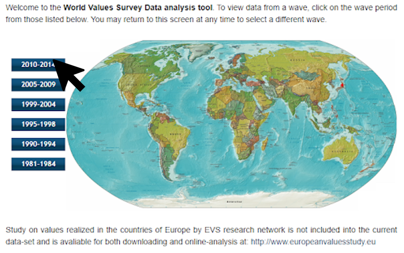

## Discovery Process of the [World Values Survey's Online Analysis Tools](http://www.worldvaluessurvey.org/WVSOnline.jsp)

### Question: How does the personal feeling of happiness in European countries impact the perceived importance of certain life values, such as family, friends, religion, etc.?

### Figure 1



### Figure 2


Countries could be ordered in a way that conveys information about their geographic location/relation. 

### Figure 3


I want to compare V4 through V9 with V10;  expected to be able to select multiple variables to show.

### Figure 4


A majority of total respondents ranked family as “Very important” (89.6%). I’m interested in comparing these survey responses to perceived happiness. 

### Markdown

Markdown is a lightweight and easy-to-use syntax for styling your writing. It includes conventions for

```markdown
Syntax highlighted code block

# Header 1
## Header 2
### Header 3

- Bulleted
- List

1. Numbered
2. List

**Bold** and _Italic_ and `Code` text

[Link](url) and 
```

For more details see [GitHub Flavored Markdown](https://guides.github.com/features/mastering-markdown/).

Hello 

### Jekyll Themes

Your Pages site will use the layout and styles from the Jekyll theme you have selected in your [repository settings](https://github.com/aleksandra-s/IVISProject2/settings). The name of this theme is saved in the Jekyll `_config.yml` configuration file.

### Support or Contact

Having trouble with Pages? Check out our [documentation](https://help.github.com/categories/github-pages-basics/) or [contact support](https://github.com/contact) and we’ll help you sort it out.
