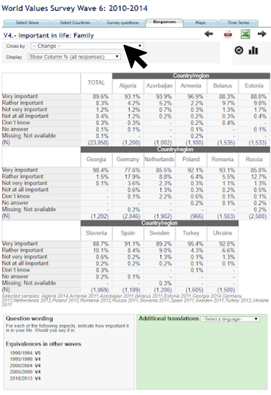

## Discovery Process of the [World Values Survey's Online Analysis Tools](http://www.worldvaluessurvey.org/WVSOnline.jsp)

### Question: How does the personal feeling of happiness in European countries impact the perceived importance of certain life values, such as family, friends, religion, etc.?

### Figure 1

### Figure 2

Countries could be ordered in a way that conveys information about their geographic location/relation. 

### Figure 3

I want to compare V4 through V9 with V10;  expected to be able to select multiple variables to show.

### Figure 4

A majority of total respondents ranked family as “Very important” (89.6%). I’m interested in comparing these survey responses to perceived happiness. 

### Figure 5

### Figure 6

### Figure 7

### Figure 8

### Figure 9

### Figure 10

### Figure 11

### Figure 12

### Figure 13

### Figure 14

### Figure 15

